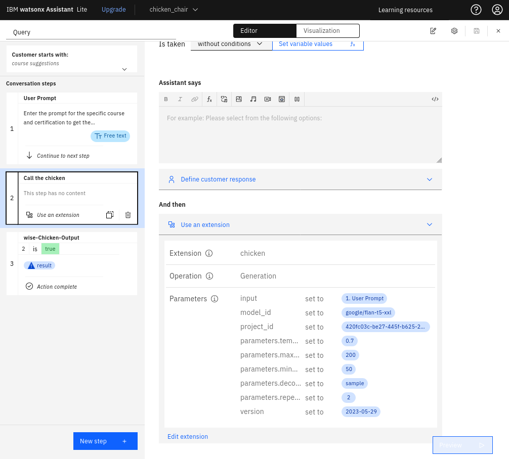
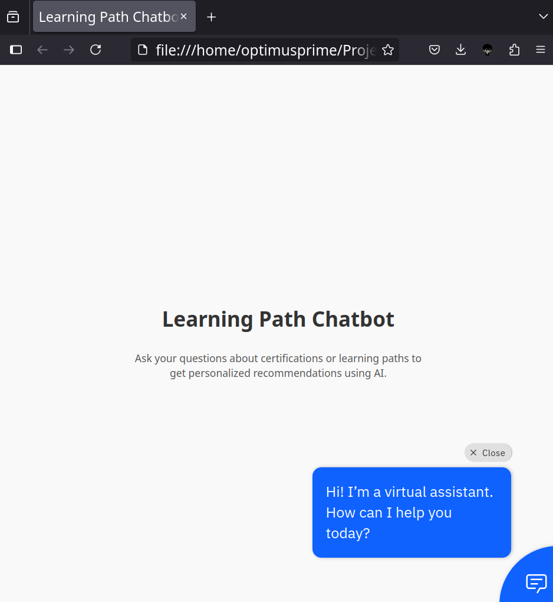
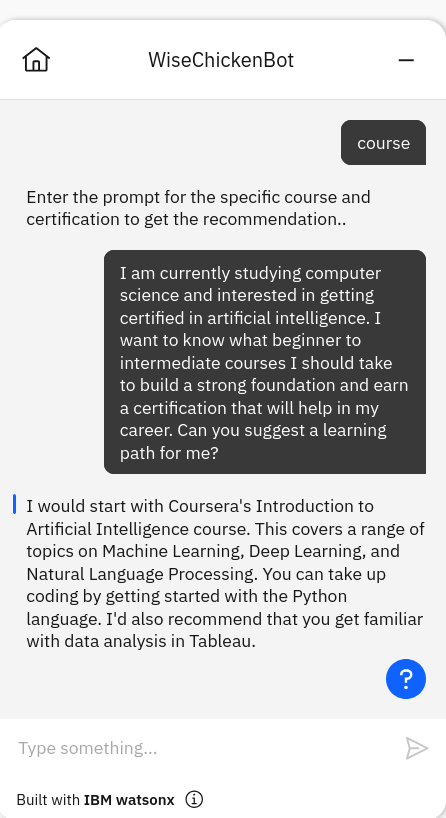

::: titlepage
{width="3cm"}
{width="3cm"}

**Course-Recommendation-Bot**

Taticherla Gnana Sai Siddartha

Roll Number: 22BCE8086

VIT-AP

Branch: CSE- AI&ML

*Date of Submission: 2025-07-06*
:::

# Introduction

A course recommendation bot to help out my fellow students. There are a
bunch of confused individuals out there, who are interested to use their
time productively by learning new courses and earning certificates, but
often gets confused on what needs to be done. Here comes the chat-bot of
mine for the rescue. IBM Watsonx and the course recommendation chatbot
enable the following:

-   Uses IBM Watsonx and retrieval-augmented generation (RAG) to offer
    personalized course recommendations based on individual interests,
    background, and current skill level.

-   Helps students find relevant certification options and learning
    materials through IBM's AI capabilities.

-   Dynamically pulls information from a curated course database using
    IBM Watsonx to clarify choices.

-   Allows students to make informed decisions about improving their
    skills without feeling overwhelmed.

-   Integrates into an easy-to-use web interface powered by IBM Watsonx
    for natural, interactive conversations.

-   Offers clear guidance for students looking to explore new learning
    opportunities with IBM's AI assistance.

-   Aids in tracking potential learning paths that match personal career
    goals.

-   Makes the upskilling process accessible, efficient, and motivating
    for learners through IBM's AI infrastructure.

-   Supports students in using their time wisely while working towards
    certification goals.

# Objective

This project aims to give a well informed course recommendations for the
users based on the prompt they provide.

# Tools & Technologies Used

-   IDEs: Neovim, Jupyter Notebook

-   Libraries: Transformers, pandas, numpy, langchain, langchain_ibm,
    ibm_watsonx_ai

-   Platform: IBM Cloud, Python 3.10

# Methodology / Working

Here's a step-by-step explanation of the working:

-   Step 1: I have used a text dataset for the project to implement RAG
    (Retrieval Augmented Generation) and imported the dataset directly
    inside the IBM Watsonx.ai project as an asset.

-   Step 2: Performed **tokenization and text splitting** on the dataset
    to prepare it for retrieval. The dataset was split into manageable
    chunks using character-based splitting for efficient vectorization
    and retrieval during the RAG process.

-   Step 3: Used embeddings with the dataset chunks and employed a
    **foundation model** from IBM Watsonx.ai to generate grounded
    answers to user queries based on retrieved relevant chunks, forming
    the retrieval-augmented generation pipeline.

-   Step 4: Evaluation and Deployment

::: center
:::

# Code Snippets with Explanation

## 1. Importing the Model {#importing-the-model .unnumbered}

    from ibm_watsonx_ai.foundation_models.utils.enums import ModelTypes
    model_id = ModelTypes.GRANITE_13B_INSTRUCT_V2

## 2. Installing Dependencies {#installing-dependencies .unnumbered}

    !pip install "langchain-core==0.1.24" | tail -n 1 
    !pip install "ibm-watsonx-ai>=0.2.6" | tail -n 1
    !pip install -U langchain_ibm | tail -n 1
    !pip install wget | tail -n 1
    !pip install sentence-transformers | tail -n 1
    !pip install "chromadb==0.3.26" | tail -n 1
    !pip install "pydantic==2.7.1" | tail -n 1
    !pip install "sqlalchemy==2.0.1" | tail -n 1

## 3. Getting Credentials {#getting-credentials .unnumbered}

    import os, getpass
    credentials = {
        "url": "https://us-south.ml.cloud.ibm.com",
        "apikey": getpass.getpass("Please enter your WML api key (hit enter): ")
    }

## 4. Obtaining Project ID {#obtaining-project-id .unnumbered}

    try:
        project_id = os.environ["PROJECT_ID"]
    except KeyError:
        project_id = input("Please enter your project_id (hit enter): ")

## 5. Fetching Dataset from IBM COS {#fetching-dataset-from-ibm-cos .unnumbered}

    import os, types
    import pandas as pd
    from botocore.client import Config
    import ibm_boto3

    cos_client = ibm_boto3.client(service_name='s3',
        ibm_api_key_id='wO1xV2-E45hGTkCtdLdLi6T7UuZGS3Ii2hyLrjjWsBcU',
        ibm_auth_endpoint="https://iam.cloud.ibm.com/identity/token",
        config=Config(signature_version='oauth'),
        endpoint_url='https://s3.direct.us-south.cloud-object-storage.appdomain.cloud')

    bucket = 'foxofwisdom-donotdelete-pr-qyfzkqdje9z8q0'
    object_key = 'sample_learning_paths.txt'

    streaming_body_0 = cos_client.get_object(Bucket=bucket, Key=object_key)['Body']

## 6. Creating a File for the Dataset {#creating-a-file-for-the-dataset .unnumbered}

    import io
    filename = "sample_learning_paths.txt"
    with io.FileIO(filename, 'w') as file: 
        for i in streaming_body_0:
            file.write(i)

## 7. Checking Dataset Contents {#checking-dataset-contents .unnumbered}

    !cat sample_learning_paths.txt

## 8. Getting Embedding Model Specifications {#getting-embedding-model-specifications .unnumbered}

    from ibm_watsonx_ai.foundation_models.utils import get_embedding_model_specs 
    get_embedding_model_specs(credentials.get('url'))

## 9. Preparing Documents for the Knowledge Base {#preparing-documents-for-the-knowledge-base .unnumbered}

    from transformers import AutoTokenizer
    from langchain.text_splitter import RecursiveCharacterTextSplitter
    from langchain.schema import Document

    tokenizer = AutoTokenizer.from_pretrained("sentence-transformers/all-MiniLM-L6-v2")

    def count_tokens(text: str) -> int:
        return len(tokenizer.encode(text, add_special_tokens=True))

    splitter = RecursiveCharacterTextSplitter(
        chunk_size=400,
        chunk_overlap=50
    )

    split_docs = splitter.split_documents(documents)
    safe_docs = [doc for doc in split_docs if count_tokens(doc.page_content) <= 510]

    print(f"Total safe chunks: {len(safe_docs)}")

    docsearch = Chroma.from_documents(safe_docs, embeddings)

## 10. Checking Help for WatsonxEmbeddings {#checking-help-for-watsonxembeddings .unnumbered}

    help(WatsonxEmbeddings)

## 11. Declaring Generation Parameters {#declaring-generation-parameters .unnumbered}

    from ibm_watsonx_ai.metanames import GenTextParamsMetaNames as GenParams 
    from ibm_watsonx_ai.foundation_models.utils.enums import DecodingMethods

    parameters = {
        GenParams.DECODING_METHOD: DecodingMethods.GREEDY,
        GenParams.MIN_NEW_TOKENS: 1,
        GenParams.MAX_NEW_TOKENS: 100,
        GenParams.STOP_SEQUENCES: ["<endoftext|>"]
    }

## 12. Invoking the Model {#invoking-the-model .unnumbered}

    from langchain_ibm import WatsonxLLM

    watsonx_granite = WatsonxLLM(
        model_id=model_id.value,
        url=credentials.get("url"),
        apikey=credentials.get("apikey"),
        project_id=project_id,
        params=parameters
    )

## 13. Retrieving Questions and Answers {#retrieving-questions-and-answers .unnumbered}

    from langchain.chains import RetrievalQA

    qa = RetrievalQA.from_chain_type(
        llm=watsonx_granite,
        chain_type="stuff",
        retriever=docsearch.as_retriever(search_kwargs={"k": 3})
    )

## 14. Example Query {#example-query .unnumbered}

    query = "what about data science"
    qa.invoke(query)

# Screenshots / Output Results

## 1.Actions page in IBM watsonx assistant {#actions-page-in-ibm-watsonx-assistant .unnumbered}

{width="90%"}

## 2.Deployed chat-bot in static web page {#deployed-chat-bot-in-static-web-page .unnumbered}

{width="90%"}

## 3.Chat-bot answering the queries {#chat-bot-answering-the-queries .unnumbered}

{#fig:chatbot_output
width="50%"}

# Project Links

Here is my link to the github page,

-   GitHub Repo: <https://github.com/Gnana01/WiseChicken>

# Challenges Faced & Solutions

The biggest challenge was to initiate the foundation model
`watsonx_granite` and handle conflicting library versions during
environment setup. I followed the step-by-step instructions provided in
the Skills Network Lab to identify and resolve these dependency
conflicts and successfully initiated the model for my
Retrieval-Augmented Generation pipeline.

# Conclusion

After working on the Project, I have got a good understanding of how the
RAG and foundation models work. Now I think I can use a huge knowledge
base and get my own ai chat-bot for personal use. And I am going to keep
working on this project and convert the web page into a dynamic website.

# References

1.  IBM watsonx.ai Documentation. Available at:
    <https://www.ibm.com/docs/en/watsonx-ai>

2.  IBM Watson Assistant Documentation. Available at:
    <https://cloud.ibm.com/docs/watson-assistant>

3.  LangChain Documentation. Available at: <https://www.langchain.com>

4.  HuggingFace Transformers Documentation. Available at:
    <https://huggingface.co/docs/transformers/index>

5.  ChromaDB Documentation. Available at: <https://docs.trychroma.com/>

6.  IBM Cloud Object Storage Documentation. Available at:
    <https://cloud.ibm.com/docs/cloud-object-storage>

7.  Retrieval-Augmented Generation (RAG) Paper, Facebook AI, 2020.
    Available at: <https://arxiv.org/abs/2005.11401>

8.  Skills Network Labs by IBM. Available at:
    <https://vit.skillsnetwork.site/my_learning>
